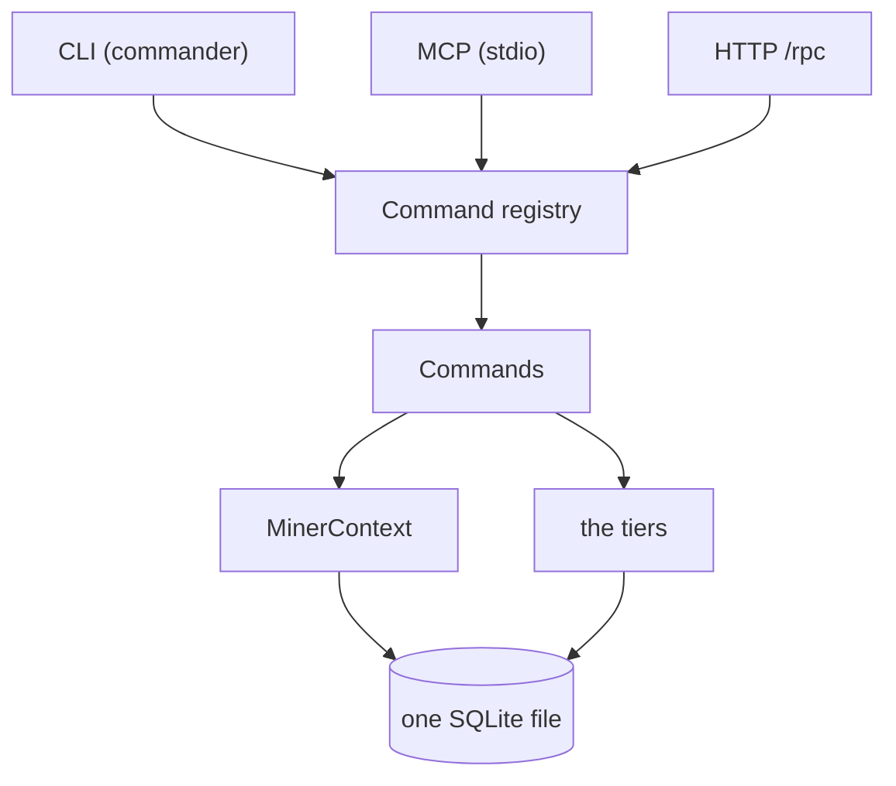

# Architecture

## The rule

A package may import only packages in its own tier or a lower one. Never sideways across a
higher tier, never upward. That single constraint is what keeps the packages from
collapsing back into the one big system they were extracted from.

It is not a convention. `.codewatch/check.json` lists every package under a tier, and CI
fails any pull request that adds an import against the order. See
[working in the repo](/guides/contributing) for how to run that check locally.

## The dependency graph

Every edge below is a real `dependencies` entry in a `package.json`, not an aspiration.
Packages with no outgoing edge depend on nothing from this repo.

```mermaid
graph TD
  subgraph T0["Tier 0 · primitives and contracts"]
    storeSqlite["store-sqlite"]
    locator["locator"]
    clusterpkg["cluster"]
    embed["embed"]
    agentProtocol["agent-protocol"]
    chatProtocol["chat-protocol"]
    codeParser["code-parser"]
    rpcProtocol["rpc-protocol"]
    evidence["evidence"]
  end
  subgraph T1["Tier 1 · engines"]
    retrieval["retrieval"]
    agent["agent"]
    registry["registry"]
    daemon["daemon"]
    hitl["hitl"]
    agentLifecycle["agent-lifecycle"]
    messaging["messaging"]
    rpcClient["rpc-client"]
    matrixBus["matrix-bus"]
  end
  subgraph T2["Tier 2 · domain"]
    sessionRead["session-read"]
    sessionGraph["session-graph"]
    codeGraph["code-graph"]
    workflow["workflow"]
    memory["memory"]
    styleProfile["style-profile"]
    styleAnalyzer["style-analyzer"]
    styleChecker["style-checker"]
    codeRead["code-read"]
    sessionAnalytics["session-analytics"]
    queueMirror["queue-mirror"]
  end
  subgraph UI["UI"]
    reactApp["react-app"]
  end
  subgraph P["Products"]
    sessionMiner["session-miner"]
    retrievalEval["retrieval-eval"]
    codeReport["code-report"]
  end

  retrieval --> embed
  retrieval --> storeSqlite
  agent --> agentLifecycle
  agent --> agentProtocol
  registry --> rpcProtocol
  daemon --> registry
  daemon --> rpcProtocol
  hitl --> storeSqlite
  agentLifecycle --> agentProtocol
  agentLifecycle --> storeSqlite
  rpcClient --> rpcProtocol
  sessionRead --> agentProtocol
  sessionRead --> locator
  sessionGraph --> agentProtocol
  sessionGraph --> clusterpkg
  sessionGraph --> locator
  sessionGraph --> sessionRead
  sessionGraph --> storeSqlite
  codeGraph --> codeParser
  codeGraph --> embed
  codeGraph --> retrieval
  codeGraph --> storeSqlite
  workflow --> agent
  workflow --> hitl
  workflow --> storeSqlite
  memory --> embed
  memory --> retrieval
  memory --> storeSqlite
  styleAnalyzer --> codeParser
  styleAnalyzer --> styleProfile
  styleChecker --> styleAnalyzer
  styleChecker --> styleProfile
  codeRead --> codeGraph
  codeRead --> registry
  codeRead --> rpcProtocol
  sessionAnalytics --> sessionGraph
  sessionAnalytics --> storeSqlite
  queueMirror --> hitl
  queueMirror --> matrixBus
  queueMirror --> storeSqlite
  reactApp --> rpcClient
  reactApp --> rpcProtocol
  sessionMiner --> clusterpkg
  sessionMiner --> daemon
  sessionMiner --> embed
  sessionMiner --> locator
  sessionMiner --> memory
  sessionMiner --> registry
  sessionMiner --> retrieval
  sessionMiner --> sessionGraph
  sessionMiner --> sessionRead
  sessionMiner --> storeSqlite
  retrievalEval --> embed
  retrievalEval --> retrieval
  retrievalEval --> storeSqlite
  codeReport --> codeRead
  codeReport --> reactApp
  codeReport --> rpcClient
  codeReport --> rpcProtocol
```

Same-tier edges such as `daemon --> registry`, `agent --> agent-lifecycle` and
`session-graph --> session-read` are legal when they remain acyclic. `store-sqlite`,
`locator`, `cluster`, `embed`, `agent-protocol`, `chat-protocol`, `code-parser`,
`rpc-protocol`, `evidence`, `messaging`, `matrix-bus`, and `style-profile` have no titan
dependencies at all, which is why any of them can be adopted on its own. The
[package families](/guides/package-families) guide groups the same packages by job.

## What each tier means

**Tier 0, primitives and wire contracts.** No product policy. `store-sqlite` knows about tables, not about sessions.
`locator` knows about byte offsets, not about transcripts. `cluster` knows about masked
token sequences, not about Bash. `embed` knows about vectors. None of them can name a
concept specific to any product. `agent-protocol` shares identity and usage vocabulary
without importing a harness SDK or runtime. `chat-protocol` and `rpc-protocol` are wire
contracts in the same spirit, `code-parser` owns tree-sitter parsing, and `evidence` checks
citations without knowing what was cited. See the [multi-harness ADR](/guides/multi-harness-contracts).

**Tier 1, engines.** Reusable machinery with a real job but no subject matter.
`retrieval` fuses ranked lists; it does not know that the things ranked are transcripts.
`registry` projects command definitions onto surfaces; it does not know what the commands
do. `daemon` hosts a registry. `agent` runs bounded Claude or Codex executions. `agent-lifecycle` persists authoritative
execution state and fenced ownership independently of transcript indexes. `hitl` pauses
work on a human. `messaging` and `matrix-bus` move text to and from a person without
knowing what the text is about. `rpc-client` calls a daemon from a browser, live or from a
snapshot file.

**Tier 2, domain.** These know a subject. `session-read` and `session-graph` normalize and index Claude and Codex transcripts. `code-graph` knows TypeScript and Python module structure.
`memory` knows what a rule with decaying confidence is. `workflow` knows what a durable
step is. `session-analytics` knows what a session cost and who ran it. `code-read` knows
how to answer questions about one code-graph snapshot. The three `style-*` packages know
what a code-style convention is. `queue-mirror` knows what a human-actionable queue item
is.

**UI.** `react-app` binds `rpc-client` to React. It carries no components or styling;
those live in the separate `@titan-design/react-ui` design system.

**Products.** Thin. A product owns its surface wiring — commander, MCP transports, its own
command definitions — and gets everything else from the tiers.

## What a product actually looks like

The session miner composes ten packages and is roughly a thousand lines of its own code.
Its structure generalises: one context type, one registry, one binding of the daemon, and a
set of commands.

One zod definition per command feeds all three surfaces. `Commands` is `refresh`, `search`,
`session`, `drain`, and `playbook`; `the tiers` is `session-graph`, `retrieval`, `cluster`,
and `memory`; `MinerContext` carries the config plus the lazily opened graph and playbook.
The [session miner case study](/guides/session-miner) follows a single query through that
diagram.

## Two time models, on purpose

`store-sqlite` ships both an interval bi-temporal edge table and a snapshot-scoped entity
table, and the choice between them is the most consequential one when you build on it.

| | Interval (bi-temporal) | Snapshot |
| --- | --- | --- |
| Right when | facts change one at a time | a whole population is re-indexed at once |
| Write | `assert`, then `expire` or `supersede` | write every row under a new `snapshot_id` |
| Key | the fact itself, plus validity columns | `(snapshot_id, id)` |
| Reading "now" | rows with `t_expired IS NULL` | rows in the latest snapshot |
| Corrections | supersede; the old row stays as history | the next snapshot simply differs |
| Used by | `session-graph`, `hitl`, `memory` | `code-graph` |

A session graph learns one fact at a time from an appended transcript line, so it wants
interval rows. A code graph re-indexes a whole tree against a commit, so it wants snapshots
— interval rows would write an unchanged row per node per index run. One physical table
cannot serve both, so `store-sqlite` offers both and each domain picks.

## Why extraction, not a rewrite

The audit that started this repo found that almost every tier already existed somewhere:
the command registry in active-work, the embeddings adapter in brain, the code graph in
codewatch, the Drain clusterer in the session miner. The work is moving each one out with
its behaviour intact, adding the one or two things it needed to be general (a fail-open
path, a hash fallback, a context type parameter), and then having the original consume the
package.

Each package page records that lineage under "where it came from", including what was
deliberately left behind. The mechanism that makes an adoption cheap is
[the binding pattern](/guides/binding-pattern).
