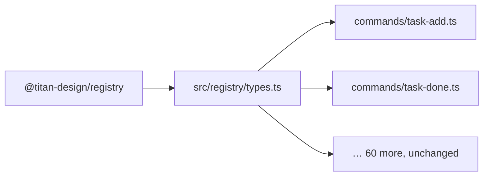

# The binding pattern

This is the idea the platform turns on. A shared package cannot know what a product's
context contains, what its tool prefix is, or where its state lives — but every call site
inside the product does. The binding pattern is how those two facts coexist without either
a fork or a hundred-file rename.

## The shape

**A package parameterises.** It takes the product-specific parts as type parameters or
options fields, and defaults nothing it cannot honestly default:

- `registry` types its `Command<Args, Result, Ctx>` on the context the command runs in.
- `daemon` takes `McpServerOptions` (registry, context factory, tool prefix, identity) and
  `DaemonPaths` (a state directory), so one process could host several daemons.
- `hitl` takes a `GateStore`; `workflow` takes a `StepRunner`; `session-graph` takes an
  optional `TaskResolver`.

**A product binds, once.** One module fixes those parameters, re-exports the result under
the product's own names, and becomes the only file in the product that mentions the
package.



The package exports `Command<Args, Result, Ctx>`. The binding module fixes `Ctx` to the
product's own `CommandContext` and re-exports `Command<Args, Result>`. Every command module
imports from the binding and never from the package.

**Everything else imports the binding.** Call sites never import the package. That is what
makes the adoption diff small and the next package version a one-file change.

## A real binding

active-work's `src/registry/types.ts`, verbatim except for the comment, which is worth
reading as written:

```ts
/**
 * active-work's binding of `@titan-design/registry` (AW-a).
 *
 * The package's `Command` carries a third type parameter for the context, so
 * every command would otherwise have to spell out `Command<A, R, CommandContext>`.
 * These aliases bind it once, which is why all 60 command modules import from
 * here unchanged. The package is the implementation; this file is the product's
 * dialect of it.
 */
import type {
  AnyCommand as PkgAnyCommand,
  BaseContext,
  Command as PkgCommand,
} from '@titan-design/registry';
import { defineCommand as pkgDefineCommand } from '@titan-design/registry';

export interface CommandContext extends BaseContext {
  activeRoot: string;
  cwd?: string;
}

export type Command<Args = unknown, Result = unknown> = PkgCommand<Args, Result, CommandContext>;
export type AnyCommand = PkgAnyCommand<CommandContext>;

export function defineCommand<Args, Result>(cmd: Command<Args, Result>): Command<Args, Result> {
  return pkgDefineCommand<Args, Result, CommandContext>(cmd);
}
```

Sixty command modules kept importing `defineCommand` and `Command` from the same path
they always had. The registry underneath them changed from 117 hand-written lines to a
dependency, and not one of them was edited.

## The test: does it add product knowledge?

A binding is legitimate when it states something only the product knows. If a module
forwards a call and adds nothing, it is a shim, and a shim should be deleted in favour of
importing the package directly.

Three legitimate bindings from the same adoption, and what each one knows:

| Binding | Product knowledge it adds |
| --- | --- |
| `registry/types.ts` | active-work's context has an `activeRoot` and an optional user `cwd` |
| `server/lifecycle.ts` | there is exactly one daemon, rooted at `getStateRoot()`; its port comes from `AW_PORT`, defaulting to 7400 |
| `server/mcp.ts` | the tool prefix is `active__`, and the MCP handshake identity is `@hjewkes/active-work` |

Each of those is a fact the package could not have guessed and must not invent. `lifecycle.ts`
resolves the paths *per call* rather than once, because active-work's tests move the state
root between cases — knowledge that lives in the product and nowhere else:

```ts
/** Resolved per call rather than once, because tests move the state root between cases. */
export function paths(): DaemonPaths {
  return daemonPaths(getStateRoot());
}

export async function writePidFile(
  pid: number,
  meta: { port: number; version: string; started: string },
): Promise<void> {
  await pkgWritePidFile(paths(), pid, meta);
}
```

Eight modules call `writePidFile(pid, meta)`. None of them learned about `DaemonPaths`.

The MCP binding pins names that are public contract:

```ts
const TOOL_NAME_PREFIX = 'active__';
const NAMING = { prefix: TOOL_NAME_PREFIX } as const;

/** The MCP identity and registry binding every entry point below shares. */
export function mcpOptions(): McpServerOptions<CommandContext> {
  return {
    registry,
    createContext: () => ({ activeRoot: getActiveRoot(), warnings: [], format: 'json' }),
    formatError,
    toolPrefix: TOOL_NAME_PREFIX,
    name: '@hjewkes/active-work',
    version: DAEMON_VERSION,
  };
}
```

`active__task__add` appears in users' MCP client configs. Renaming it would break them, so
the prefix is pinned in one place and asserted by a test. The package supplies the
projection; the product supplies the name.

## When a binding is not needed

The same adoption left `logger.ts` completely untouched. `daemon` types its logger as
anything with pino's `(fields, message)` call signature, so active-work's existing pino
instance satisfied it structurally with no adapter at all.

That is the other half of the discipline: parameterise on a *structural* type where you
can, and the product needs no binding module. Prefer this. A binding you did not have to
write is better than a good one.

## Doing an adoption

1. **Find the seam.** What does the package need that only you know? Usually a context
   type, a path root, a name prefix, or an error formatter.
2. **Write the binding module first**, before touching any call site. Give it the names the
   call sites already use.
3. **Delete the old implementation** and point the binding at the package.
4. **Run the tests unchanged.** If call sites needed edits, the binding is incomplete. That
   is the signal to go back to step 2, not to start a find-and-replace.

The measure of a good adoption is that the test suite does not move. In the active-work
adoption, `src/registry/` went from 117 lines across four files to two files of binding,
`src/server/` went from 1,302 lines to 632, about a thousand lines were deleted overall,
and all 1,321 tests were unchanged from the baseline.

[The full case study](/guides/adopting-a-package) walks through that adoption, including
the two regressions the binding nearly hid.
