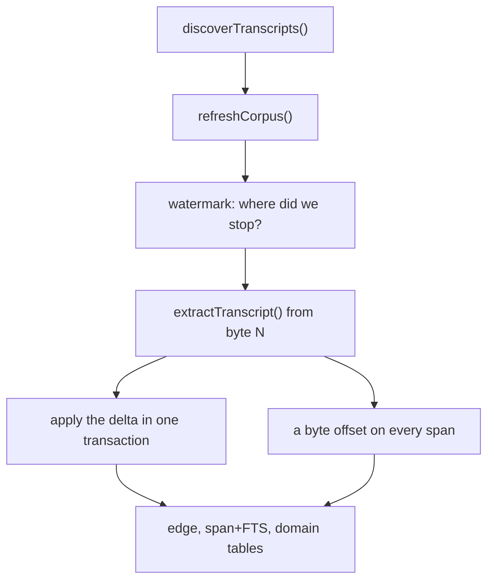
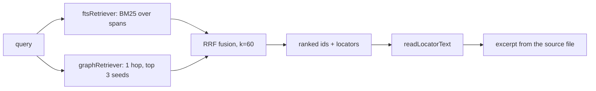

# Case study: the session miner

The session miner indexes every Claude Code transcript on a machine into a queryable graph,
searches it, clusters its recurring failures, and serves all of that over a CLI, MCP, and
HTTP from one command registry. It is the first product on the platform, and it exists as
much to prove the DAG end to end as to be useful.

It composes ten packages and is about a thousand lines of its own code. It lives at
`products/session-miner` and is private, so run it from a checkout.

## What it does

```sh
titan-miner refresh                          # index new transcript bytes
titan-miner search "daemon 503 at startup"   # full text, expanded through the graph
titan-miner session show <session-id>
titan-miner drain ingest                     # cluster tool errors into templates
titan-miner playbook recall "release job npm"
titan-miner serve --port 7400                # /rpc, /mcp, /events on loopback
titan-miner mcp                              # MCP over stdio
```

## A refresh, package by package

`titan-miner refresh` is four lines of miner code plus four packages doing the work.



`discoverTranscripts` and `extractTranscript` come from `session-read`, `refreshCorpus` and
the delta application from `session-graph`, the watermark and tables from `store-sqlite`, and
the byte offsets from `locator`.

```ts
const graph = ctx.graph();
if (args.full) resetIndex(graph);
const discovered = await discoverTranscripts(ctx.config.corpusRoot);
return refreshCorpus(graph, discovered, { full: args.full, verifyHash: args.verify_hashes });
```

That is the whole command body. Real output over eight transcripts:

```json
{
  "transcripts": 8, "indexed": 8, "unchanged": 0, "rewound": 0,
  "missing": 0, "quarantined": 0, "facts": 1899, "turnsRolledUp": 10,
  "reconciled": { "prCreates": 0, "prMerges": 0, "subagents": 0 },
  "tasks": { "requested": 0, "applied": 0, "failed": false },
  "markedMissing": 0
}
```

Run it again and every transcript reports `unchanged`, because the watermark table knows the
byte offset and prefix hash each file was indexed to. A file that grew is read from its
watermark. A file that was rewritten is detected by the prefix hash and rewound. A file that
Claude Code pruned is marked `missing` and its facts stay — surviving that pruning is much
of the point.

## A search, package by package

The interesting property is that **the index stores no transcript text**. `search` gets ids
and byte ranges back, then reads the original bytes to build an excerpt.



```ts
const fts = ftsRetriever(graph.spans);
const engine = createRetrievalEngine({
  retrievers: [fts, graphRetriever(graph.edges, fts, { seedLimit: 3, hops: 1 })],
  timeoutMs: 5_000,
});
const { results, degraded } = await engine.search(args.query, { limit: args.limit });
```

Two hits from a real run, trimmed:

```json
{
  "hits": [
    {
      "ref": "session:5a24a94a-2a27-4c33-87ea-af1b6761a02d",
      "score": 0.0164,
      "sources": ["fts"],
      "locator": { "transcript": "~/.claude/projects/…/5a24a94a….jsonl",
                   "byteOffset": 760589, "byteLength": 2724, "field": "tool_input" },
      "excerpt": "/Users/hjewkes/projects/…/tests/test_logic.py\n  test_cactus_planner, test_layout, …"
    },
    {
      "ref": "file:farmer-was-replaced/CLAUDE.md",
      "score": 0.0164,
      "sources": ["graph"],
      "locator": null,
      "excerpt": null
    }
  ],
  "degraded": []
}
```

The first hit came from full-text search and carries a locator, so the miner read
2,724 bytes at offset 760,589 out of the original JSONL and projected the same field that
was indexed. The second hit is a *file*, not a session: the graph retriever took the
full-text winner as a seed and walked one hop along `session:… touched file:…` edges. A
graph-only hit has no locator, which is why `excerpt` is null rather than fabricated.

`degraded` is empty here. Had the FTS index been locked, it would name the retriever and the
reason, and the graph results would still have come back. That is `retrieval`'s fail-open
contract.

## Clustering the failures

`drain ingest` reads each unclustered `tool_result_error` fact through its locator, screens
it with `cluster`'s `hasErrorSignal`, and clusters the survivors:

```json
{ "candidates": 4, "screened": 3, "clustered": 1, "newTemplates": 1, "templates": 1, "unreadable": 0 }
```

Screening matters: successful tool output has unbounded cardinality and would produce one
template per invocation. The clusterer's snapshot lives in the same database, so template
ids survive a restart.

## One registry, three surfaces

Every command above is a single `defineCommand` call. The CLI (commander), the daemon's
`/rpc` and `/mcp` routes, and MCP over stdio are all projections of the same registry:

```ts
export function createMinerRegistry(): CommandRegistry<MinerContext> {
  const registry = createRegistry<MinerContext>();
  const commands = [refresh, status, search, sessionList, sessionShow, drainIngest, ...];
  for (const cmd of commands) registry.register(cmd);
  return registry;
}
```

and the daemon binding is one options object:

```ts
export function serveOptions(config: MinerConfig, options: ServeOptions = {}): StartDaemonOptions<MinerContext> {
  return {
    registry: createMinerRegistry(),
    createContext: () => createMinerContext(config),
    version: MINER_VERSION,
    stateDir: config.stateDir,
    port: options.port,
    toolPrefix: TOOL_PREFIX,          // "miner__"
    mcpName: "titan-session-miner",
    health: () => summarize(health),  // sessions indexed + FTS orphan ratio
    watchRoot: config.stateDir,
  };
}
```

`toolPrefix` and `mcpName` are the product knowledge; everything else is the package. See
[the binding pattern](/guides/binding-pattern).

## The context is where the wiring lives

`MinerContext` extends the registry's `BaseContext` and opens the database lazily, so a
read-only command never touches disk needlessly:

```ts
export interface MinerContext extends BaseContext {
  config: MinerConfig;
  graph(): SessionGraph;
  playbook(): PlaybookStore;
  reflector?: Reflector;
  close(): void;
}
```

One SQLite file holds all of it: the session graph's kit and domain tables, the Drain
snapshot, and the `memory` playbook. The playbook is strictly downstream — it reads the
graph and never writes back, and a test asserts the graph's row counts do not move when the
playbook is exercised.

## What is deliberately not there yet

- **No vector search.** The `embed` dependency is wired but no vector index is built, so
  both `search` and `playbook recall` are keyword-only today.
- **No dashboard.** That waits on the UI package split.
- **No scheduler.** The daemon serves; a supervisor drives `refresh`.
- **Per-tool Drain partitions** wait on the fact table carrying tool names for results.

The value of naming these is that each is a gap in a *product*, not in a package. The
packages already support the missing halves.
