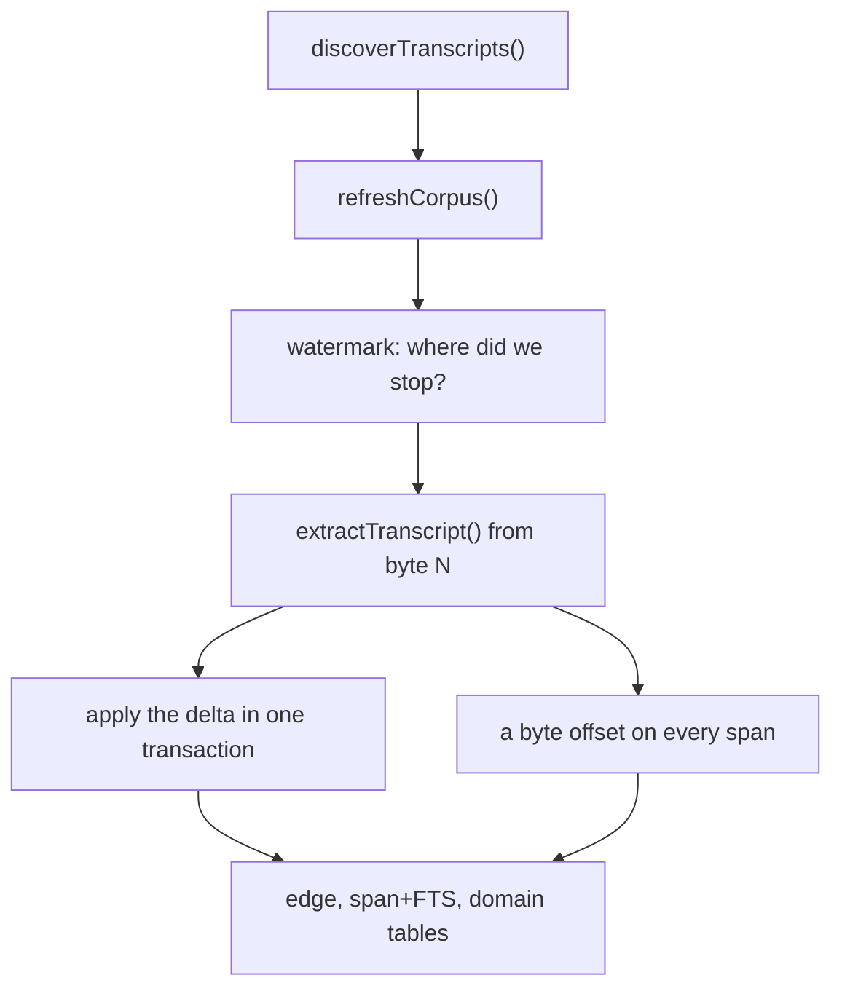
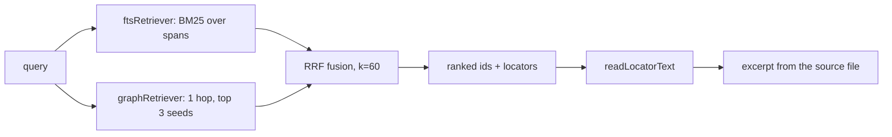

# Case study: the session miner

The session miner indexes every Claude Code transcript on a machine, and Codex sessions
when asked, into a queryable graph. It searches that graph, clusters its recurring failures,
and serves all of that over a CLI, MCP, and HTTP from one command registry. It is the first product on the platform, and it exists as
much to prove the DAG end to end as to be useful.

It is a thin composition over the `@titan-design/*` packages. It lives at
`products/session-miner` and is private, so run it from a checkout.

## Run it

The first half of this page is the usage guide. The second half, from
[a refresh, package by package](#a-refresh-package-by-package), is the case study.

### Prerequisites and build

Node 20 or newer and pnpm 9. The product is private and is not on npm, so run it from a
checkout. Nothing needs a model, and nothing needs a network except `insights blocked-flow`,
which asks GitHub for PR states through `gh` unless you pass `--pulls <file>`.

```sh
git clone https://github.com/HJewkes/titan-platform
cd titan-platform
pnpm install --frozen-lockfile && pnpm build
node products/session-miner/dist/bin.js --help
```

The examples write `titan-miner` for `node products/session-miner/dist/bin.js`.

### Commands

```sh
titan-miner refresh                          # index new transcript bytes
titan-miner refresh --full                   # rebuild from byte 0
titan-miner refresh -n 50 --verify-hashes    # at most 50 transcripts; detect same-length rewrites
titan-miner status                           # counts, transcript states, FTS orphan ratio
titan-miner search "daemon 503 at startup" -n 5
titan-miner session list -n 20 --since 2026-09-01T00:00:00Z
titan-miner session show <session-id>        # token usage, turns, and relations
titan-miner drain ingest -n 500              # cluster tool errors into templates
titan-miner drain templates -n 10            # most frequent first
titan-miner playbook add "Pin npm to 11 in release jobs" --tag ci --category release
titan-miner playbook add "Never force-push main" --negative --session <session-id>
titan-miner playbook recall "release job npm" -n 5
titan-miner playbook reflect <session-id>    # renders the diary; applies nothing
titan-miner playbook status
titan-miner insights cache-ttl --since 2026-09-01   # one of six questions; see Insights
titan-miner serve --port 7400                # /health, /rpc, /mcp, /events on loopback
titan-miner mcp                              # MCP over stdio
```

Six options go before the command and apply to all of them:

| Option | Environment | Default |
| --- | --- | --- |
| `--state <dir>` | `TITAN_MINER_STATE` | `~/.local/state/titan-session-miner` |
| `--corpus <dir>` | `TITAN_MINER_CORPUS` | `~/.claude/projects` |
| `--codex-home <dir>` | `TITAN_MINER_CODEX_HOME` | unset; Codex sessions are not indexed |
| `--namespace <name>` | `TITAN_MINER_NAMESPACE` | the hostname, when a Codex home is set |
| `--graph <file>` | `TITAN_MINER_GRAPH` | unset; the miner uses `index.sqlite3` in the state directory |
| `--json` | | off; prints the `{ ok, data }` envelope the HTTP and MCP surfaces return |

Pick a stable `--namespace` for each host and account. Moving a Codex source must not rename
its conversations (`products/session-miner/src/config.ts`).

`--graph` points the miner at a session graph another owner writes, such as active-work's.
The miner opens it read-only: it runs no migrations and reconciles no prices, because that
schema is the owner's to maintain. Use it to search or ask insights of that graph, not to
`refresh` it.

### Insights

`insights <question>` answers one cost or flow question and ends its text with the
list-price caveat. Each question is also an MCP tool, `miner__insights__<question>`.

| Question | What it answers | Own inputs |
| --- | --- | --- |
| `spend-by-action` | where each role's spend goes by turn action, and how much is mechanical | `--mechanical <class>` |
| `handoff-threshold` | when each role should hand over: boot cost, fill growth, best context threshold K | `--k`, `--reviewer-prs`, `--broker-log` |
| `cache-ttl` | what a 5-minute cache TTL would save against 1h, per role and profile | none |
| `wake-economics` | what wakes a coordinator, and the requests and cost of each wake episode | `--episode-role <role>` |
| `blocked-flow` | per repo: verdict-to-merge minutes, PRs holding a MERGE, classifier denials, idle implementer slots | `--seat`, `--split-at`, `--transcript`, `--journal`, `--pulls` |
| `liveness` | seats dark over 5 minutes, missed routes, unreported exits, agents stuck on a permission prompt | `--seat`, `--broker-log` |

The first four read the session graph and take the shared filters `--session`,
`--agent-prefix`, `--role`, `--since` and `--until`. `blocked-flow` and `liveness` read
agent-chat's files instead (`TITAN_MINER_EVENTS_DB`, default `~/.agent-chat/events.db`, and
`TITAN_MINER_BROKER_LOG`, default `~/.agent-chat/broker.log`), so they take only `--since`
and `--until` and narrow with `--seat`. Options that name a local file (`--broker-log`,
`--transcript`, `--journal`, `--pulls`) are accepted only on the CLI.

### Where state lives

Unless `--graph` names another file, everything is in the state directory: `index.sqlite3` holds the session graph, the Drain
snapshot and the playbook. While `serve` runs, `daemon.pid` and `daemon.meta.json` sit
beside it. `serve` logs to stderr. The miner only reads the corpus; the index stores byte
ranges, not transcript text.

`serve` exposes each command as `POST /rpc/<name>` and as an MCP tool named
`miner__<name>`, with dots as double underscores (`miner__session__show`). A `/rpc` call
needs an `Origin` or `X-Titan-Client` header. `GET /health` reports the session count and
the FTS orphan ratio.

### How it fails

| What you see | Why |
| --- | --- |
| `"transcripts": 0` from `refresh`, exit 0 | the corpus directory is empty or missing; that is not an error |
| `error: no session <id>`, exit 66 | `session show` or `playbook reflect` on an unknown id |
| `error: unknown command '…'`, exit 64 | a usage error |
| `error: Daemon already running (pid N, port P)`, exit 70 | a second `serve` on the same state directory |
| a hit with `"excerpt": null` and a locator | the source bytes changed or the file was pruned after indexing |
| a name in `degraded` from `search` | one retriever failed; the others still answered |

## A refresh, package by package

`titan-miner refresh` is four lines of miner code plus four packages doing the work.


```mermaid
graph TD
  disc["discoverTranscripts()"] --> refresh
  refresh["refreshCorpus()"] --> wm["watermark: where did we stop?"]
  wm --> read["extractTranscript() from byte N"]
  read --> apply["apply the delta in one transaction"]
  apply --> tables["edge, span+FTS, domain tables"]
  read --> loc["a byte offset on every span"]
  loc --> tables
```

`discoverTranscripts` and `extractTranscript` come from `session-read`, `refreshCorpus` and
the delta application from `session-graph`, the watermark and tables from `store-sqlite`, and
the byte offsets from `locator`.

```ts
const graph = ctx.graph();
if (args.full) resetIndex(graph);
const discovered = await discoverTranscripts(ctx.config.corpusRoot);
return refreshCorpus(graph, discovered, { full: args.full, verifyHash: args.verify_hashes });
```

That is the core of the command. Output over a one-transcript synthetic corpus (one prompt,
one reply with a `Read` call, one failed tool result):

```json
{
  "transcripts": 1, "indexed": 1, "unchanged": 0, "rewound": 0,
  "missing": 0, "quarantined": 0, "facts": 3, "turnsRolledUp": 1,
  "reconciled": { "prCreates": 0, "prMerges": 0, "subagents": 0 },
  "tasks": { "requested": 0, "applied": 0, "failed": false },
  "origins": { "requested": 0, "applied": 0, "events": 0, "failed": false },
  "prs": { "requested": 0, "applied": 0, "failed": false },
  "reviews": { "resolved": 0, "unresolved": 0, "invalidTimes": 0 },
  "markedMissing": 0, "facetsBackfilled": 0, "facetBacklog": 0
}
```

Run it again and every transcript reports `unchanged`, because the watermark table knows the
byte offset and prefix hash each file was indexed to. A file that grew is read from its
watermark. A file that was rewritten is detected by the prefix hash and rewound. A file that
Claude Code pruned is marked `missing` and its facts stay — surviving that pruning is much
of the point.

## A search, package by package

The interesting property is that **the index stores no transcript text**. `search` gets ids
and byte ranges back, then reads the original bytes to build an excerpt.


```mermaid
graph LR
  q["query"] --> fts["ftsRetriever: BM25 over spans"]
  q --> graphr["graphRetriever: 1 hop, top 3 seeds"]
  fts --> fuse["RRF fusion, k=60"]
  graphr --> fuse
  fuse --> hits["ranked ids + locators"]
  hits --> loc["readLocatorText"]
  loc --> ex["excerpt from the source file"]
```

```ts
const fts = ftsRetriever(graph.spans);
const engine = createRetrievalEngine({
  retrievers: [fts, graphRetriever(graph.edges, fts, { seedLimit: 3, hops: 1 })],
  timeoutMs: 5_000,
});
const { results, degraded } = await engine.search(args.query, { limit: args.limit });
```

Two of the three hits from the same synthetic corpus, trimmed:

```json
{
  "hits": [
    {
      "ref": "session:11111111-2222-4333-8444-555555555555",
      "score": 0.0164,
      "sources": ["fts"],
      "locator": { "transcript": "<corpus>/-work-example/11111111-….jsonl",
                   "byteOffset": 0, "byteLength": 317, "field": "prompt" },
      "excerpt": "Why does the daemon return 503 at startup?"
    },
    {
      "ref": "file:/work/example/src/daemon.ts",
      "score": 0.0161,
      "sources": ["graph"],
      "locator": null,
      "excerpt": null
    }
  ],
  "degraded": []
}
```

The first hit came from full-text search and carries a locator, so the miner read 317 bytes
at offset 0 out of the original JSONL and projected the same field that was indexed. The
second hit is a *file*, not a session: the graph retriever took the full-text winner as a
seed and walked one hop along `session:… touched file:…` edges. A graph-only hit has no
locator, which is why `excerpt` is null rather than fabricated.

`degraded` is empty here. Had the FTS index been locked, it would name the retriever and the
reason, and the graph results would still have come back. That is `retrieval`'s fail-open
contract.

## Clustering the failures

`drain ingest` reads each unclustered `tool_result_error` fact through its locator, screens
it with `cluster`'s `hasErrorSignal`, and clusters the survivors:

```json
{ "candidates": 1, "screened": 0, "clustered": 1, "newTemplates": 1, "templates": 1, "unreadable": 0 }
```

`drain templates` then lists the template with its masked signature,
`Error Error: ENOENT: no such file or directory, open '<PATH>' [<NUM>]`.

Screening matters: successful tool output has unbounded cardinality and would produce one
template per invocation. The clusterer's snapshot lives in the same database, so template
ids survive a restart.

## One registry, three surfaces

Every command above is a single `defineCommand` call. The CLI (commander), the daemon's
`/rpc` and `/mcp` routes, and MCP over stdio are all projections of the same registry:

```ts
export function createMinerRegistry(): CommandRegistry<MinerContext> {
  const registry = createRegistry<MinerContext>();
  const commands = [refresh, status, search, sessionList, sessionShow, drainIngest, ...];
  for (const cmd of commands) registry.register(cmd);
  return registry;
}
```

and the daemon binding is one options object:

```ts
export function serveOptions(config: MinerConfig, options: ServeOptions = {}): StartDaemonOptions<MinerContext> {
  return {
    registry: createMinerRegistry(),
    createContext: () => createMinerContext(config),
    version: MINER_VERSION,
    stateDir: config.stateDir,
    port: options.port,
    toolPrefix: TOOL_PREFIX,          // "miner__"
    mcpName: "titan-session-miner",
    health: () => summarize(health),  // sessions indexed + FTS orphan ratio
    watchRoot: config.stateDir,
  };
}
```

`toolPrefix` and `mcpName` are the product knowledge; everything else is the package. See
[the binding pattern](/guides/binding-pattern).

## The context is where the wiring lives

`MinerContext` extends the registry's `BaseContext` and opens the database lazily, so a
read-only command never touches disk needlessly:

```ts
export interface MinerContext extends BaseContext {
  config: MinerConfig;
  graph(): SessionGraph;
  playbook(): PlaybookStore;
  reflector?: Reflector;
  close(): void;
}
```

One SQLite file holds all of it: the session graph's kit and domain tables, the Drain
snapshot, and the `memory` playbook. The playbook is strictly downstream — it reads the
graph and never writes back, and a test asserts the graph's row counts do not move when the
playbook is exercised.

## What is deliberately not there yet

- **No vector search.** The `embed` dependency is wired but no vector index is built, so
  both `search` and `playbook recall` are keyword-only today.
- **No dashboard.** That waits on the UI package split.
- **No scheduler.** The daemon serves; a supervisor drives `refresh`.
- **Per-tool Drain partitions** wait on the fact table carrying tool names for results.

The value of naming these is that each is a gap in a *product*, not in a package. The
packages already support the missing halves.
