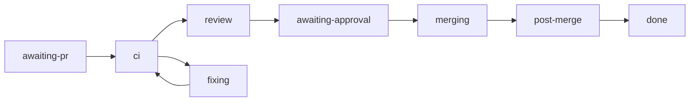

# Shepherd: from a registered PR to a merge

Shepherd is the `shepherd-pr` workflow inside the [factory](/guides/factory) and the
`titan-factory shepherd` verbs that drive it. You register a pull request, or a branch whose
pull request is not open yet. Shepherd then waits for CI, keeps the branch current, asks for
the merge decision its policy requires, merges the exact approved head, and reads main CI on
the merge commit.

Read [what is not built yet](#what-is-not-built-yet) before you rely on it. The review phase
runs only when `shepherd.review` is configured. Without it, every Shepherd merge waits for
the owner.

## Prerequisites

Everything in the [factory guide](/guides/factory#prerequisites): a built checkout, `gh`
logged in, and a base branch with at least one required check. Run `titan-factory serve` so
runs stay alive after your shell exits. Each verb below calls the server when one answers on
`--port` (default 7410) and opens the database directly when none does. Every verb takes
`--json` to print the result object instead of the one-line form.

## Register

```sh
titan-factory shepherd register owner/repo#123 --task initiative/42 --implementer impl-1
titan-factory shepherd register owner/repo --branch feat/example --task initiative/42 --implementer impl-1
```

```
run ab0f9228-… shepherd-pr owner/repo (feat/example): started; policy owner-gate
```

`--task` and `--implementer` are required. The target is `owner/repo#N`, or `owner/repo`
with `--branch`. The other flags:

| Flag | Meaning |
| --- | --- |
| `--reviewer <name>` | the agent that reviews |
| `--kind <kind>` | `correctness`, `security`, `feature`, `refactor` or `unknown` (the default) |
| `--policy <json>` | narrows the seat policy; see [seat policy](#seat-policy) |

Registration is idempotent (`products/factory/src/shepherd/commands.ts`). A repeat for the
same `repo#pr`, or for the pull request's head branch, updates the task, implementer,
reviewer, kind and policy on the existing registration and returns the same run:

```
run ab0f9228-… shepherd-pr owner/repo (feat/example): already registered, metadata updated; policy never
```

A repeat starts a new run instead when the registration's run is dead: it failed, or it
completed stopped `not-mergeable` or on a `conflict` while the pull request is still open,
as when no agent took the conflict wake and a seat then pushed a fix. The new run starts at
the pull request's current head, the registration and its recorded authors move to it, and
the old run still reads. The verb prints `restarted after failed run <id>` or
`restarted after run <id> stopped not-mergeable`. A run that merged, or stopped for any other
reason (`abandoned`, `closed`, `stuck-behind`, `merge-denied`), comes back unchanged.

A repeat without `--kind` keeps the stored kind. What the kind controls today is carry and
these refusals: only `correctness`, `feature` and `refactor` may carry a reviewed MERGE across
a tree-equal update (MRG-AU-RC) or across a merge of the base whose remerge-diff resolved
nothing reviewed (MRG-AU-RM); `security` and `unknown` always get a fresh review. A tree-equal
update carries only when it is a clean merge-up: its first parent is the reviewed head (or a
head an earlier merge-up carried that MERGE to), its second parent is on the base branch, and
its tree equals `git merge-tree --write-tree` of the two. A conflict resolution, an extra
commit or a rebase gets a fresh review. The run log records each clean merge-up as an
`sh-merge-up` step naming the reviewed head, the new head, the base commit and the rule
`clean-merge-up`. The kind
does not run or skip the fix-proof check; nothing reads it for that. An explicit `--kind`
replaces the stored kind, unless it would move a `correctness` run to `feature`, `refactor` or
`unknown`, or a `security` run to any other kind. That repeat is refused with exit 65 and a
reason naming both kinds. Moving `correctness` to `security`, or `feature`, `refactor` or
`unknown` to any kind, still applies.

A branch registered first and its pull request registered later share one run. A
registration by number reads the pull request from GitHub to learn its head branch, so it
needs `gh`. A `--branch` that is not the pull request's head is refused.

With no server running, the run is recorded and the verb says so on stderr:
`no titan-factory serve answered on port 7410, so the run was recorded here; titan-factory
serve drives it`.

## Phases



A phase is a view over the run's current step (`products/factory/src/shepherd/view.ts`).

| Phase | The run is |
| --- | --- |
| `awaiting-pr` | polling every 30 seconds for a pull request on the registered branch, with no timeout |
| `ci` | reading branch rules, waiting for required checks, updating a branch that is behind, or rerunning a cancelled run |
| `fixing` | waking the implementer for red CI, a `FIX_FIRST`, a conflict or a failed fix-proof check, then waiting for its new head; or waiting for a new head after a human chose to await a fix |
| `review` | reading the review verdict and the registration's policy for a green head |
| `awaiting-approval` | recording the merge decision, or waiting on a gate: `approve-merge`, `ci-failed`, `sh-sent-back` or `stuck-behind` |
| `merging` | merging the approved head; a [held](#hold-and-release) pull request, or one waiting for the [merge train](#merge-train), waits here |
| `post-merge` | reading main CI on the merge commit, for up to 60 minutes, then [freezing on red or thawing on green](#after-the-merge) |
| `done`, `failed`, `cancelled` | finished |

A `done` run did not necessarily merge. A run that stops unmerged (closed, abandoned,
merge-denied, stuck-behind, not-mergeable, conflict) records an `sh-stopped` step with the
reason, and the `WatchRow` `outcome` field reads `merged` or `stopped` with that reason.

Shepherd runs no deploy, release or activation stage and does not run the factory's
`postMerge` chore.

## After the merge {#after-the-merge}

The `sh-main-ci` step reads main CI on the merge commit once, for up to 60 minutes. What
happens next depends on the verdict (`products/factory/src/shepherd/post-merge.ts` and
`main-red.ts`).

A run at the merge commit that concurrency cancelled because a newer main push superseded
it is not red. When every failed run was cancelled and main's tip is a later push that
contains the merge commit, Shepherd reads CI at that tip instead (`MAIN_CI_ROUTES` in
`products/factory/src/shepherd/route-table.ts`). A cancelled run with no newer push is red.

Which runs judge the commit depends on the base branch's rules. When it requires status
checks (rulesets first, then classic branch protection), only those required contexts judge
it, each by its newest run from the app it is pinned to (GitHub Actions when unpinned). A red
job outside them, such as `release` or `deploy`, is recorded as a `warning` on the step's
result and freezes nothing. A required context with no run yet, or one still running, is not
green. A repo with no required checks, or a rules read that fails, keeps the rule that every
Actions run on the commit must pass, so an API failure never thaws a red main.

**Closing the task.** Whatever the verdict, the last step, `sh-cleanup`, closes the registration's
`--task` over active-work's loopback rpc when the registration names no `--slice`. It first appends
`closed by Shepherd: <owner/repo>#<n> at <merge sha> merged` to the task's notes, then marks it done.
A task that is already done is left alone, so a replay after a restart closes nothing twice and adds no
second note. If active-work cannot be reached, the step gives up after an hour, records `task <initiative>/<id> not
closed: <error class>` as a caveat on its result, and the run still completes. A slice registration only
notes the landing and leaves its task open for the seat to close after live evidence.

**Unread.** No run appeared at the merge sha. The run opens `main-red` and freezes nothing.

**Red.** The run freezes the repo, then works through three steps:

1. `sh-freeze` freezes the repo at the merge sha. A freeze is one row per repo; a red in a
   live freeze counts up, and a red after a thaw starts a new episode.
2. `sh-file-fix-task` files one high-severity active-work task per episode, over
   active-work's loopback rpc (`127.0.0.1:$AW_PORT`, default 7400). The task goes into the
   initiative of the merged pull request's `--task` when that reads `<initiative>/<id>`, and
   into `titan-platform` otherwise. It carries the failing jobs and their fenced log tails,
   and is tagged with a key built from the repo and the merge sha, so a replay after a crash
   finds it instead of filing a second one. A daemon that is down is retried for up to 60
   minutes.
3. `sh-spawn-fixer` spawns one fixer per episode, if the run's policy grants `fixer`. The
   grant holds when a seat lists the repo and `--policy` does not set `"fixer":false`. The
   fixer is a headless agent-chat agent on the `bd-implementer` profile (a pane nobody
   watches would help no one, and that profile's grant covers the verbs it needs), named
   `fix-<repo>-<short merge sha>`, started in the repo's seat checkout. Its brief tells it to
   register its fix pull request with the fix task and with itself as `--implementer`. It
   needs `shepherd.agentChatBin` in the [config file](/guides/factory#the-config-file).

Both steps write only to the episode `sh-freeze` returned. If the repo thaws while a step
waits, the step files or spawns nothing more, records nothing, and the run moves on to
cleanup without a gate. That holds even if a new red has frozen the repo again. A fixer
already spawned by then is reported in the step's detail and keeps running.

While the repo is frozen, every merge route waits in `merging`, the same way a hold does.
One pull request is exempt: the one whose registration names the episode's fix task and
the episode's fixer as its implementer. The guard also re-reads the default branch at most
every five minutes, and a green head there thaws the repo.

**Green.** `sh-unfreeze` thaws a frozen repo when the merge commit descends from the red sha
and every check that was red there ran green again (when the base branch has required
checks, every required context green). A path filter that skips a red check
therefore cannot thaw it.

Every outcome that leaves the repo frozen with nothing in place to clear it opens a gate
with the owner's release on offer:

- `main-red-again`: main went red while the episode already had a fixer, the fixer's own
  merge included. No second fixer is spawned.
- `main-frozen`: no fix task was filed, no fixer was spawned (notify-only policy, no
  agent-chat, no checkout, or a failed spawn), or a green merge left the repo frozen.

The answer is `{"decision":"stay-frozen"|"unfreeze","mergeSha":"<merge sha>"}`. `unfreeze`
thaws only the episode the gate opened for. If the repo has thawed and frozen again since,
the answer changes nothing. Each run opens its own gate, so one episode can leave several
open; answer any one with `unfreeze` and the rest go stale.

## Routing a reviewed head {#routing}

After the review of a green head, the `sh-observe` step reads the pull request again, and one
table decides what happens next (`products/factory/src/shepherd/route-table.ts`). The table
is keyed by three things: whether the pull request is still open, GitHub's
`mergeable_state`, and what the review came to. Every cell has a route, and a test fails if
one is missing.

| State at `sh-observe` | `MERGE` | `FIX_FIRST` | no verdict, or the wait ran out | hold's reviewer has not answered |
| --- | --- | --- | --- | --- |
| `clean`, `blocked`, `unstable`, `has_hooks` | merge decision | wake the fixer | fresh reviewer | read the hold's reviewer again |
| `behind` | update the branch, new round | wake the fixer | update the branch, new round | update the branch, new round |
| `dirty` | wake the fixer | wake the fixer | wake the fixer | wake the fixer |
| `unknown` | new round | wake the fixer | new round | new round |
| `draft` | end the run | wake the fixer | end the run | end the run |

A head that moved during the review always starts a new round, and the new head is reviewed.
A pull request merged or closed outside Shepherd ends the run: a merge goes on to the
post-merge read, a close stops. `titan-factory serve` also checks, every 5 minutes, the pull
request of each run that is waiting on a gate. When that pull request was merged or closed
elsewhere, the serve process cancels the run and its gate. The same check supersedes a gate
whose open pull request moved head, as resync does below.

Every `titan-factory serve` start resyncs before it adopts a run. Each running or paused run
whose pull request was merged outside Shepherd ends with a reason that starts
`landed elsewhere: `, and one whose pull request was closed ends with `closed elsewhere: `. A
pending gate whose run already ended is cancelled as orphaned, and a gate whose open pull
request moved head is superseded. That covers a seat-policy, merge-guard, MRG-AU or
`shepherd-route/failed-rounds` `approve-merge` gate, an `sh-sent-back` gate, a `ci-failed`
gate and a `stuck-behind` gate. Any other `shepherd-route` gate, such as a conflict, stays with the owner. A superseded
failed-rounds gate starts the new head's review rounds from zero, so the run does not ask the
owner again before the new head has failed its own rounds. A superseded `ci-failed` gate reads as
`await-fix`, so the run lands the new head with no owner answer. A superseded `stuck-behind`
gate starts a new land round at the new head with a fresh update budget. Resync also answers
the active `merge` step of a run no runtime holds, when the head that step merges is no longer
the pull request's head: the answer is no merge, so the run reads CI and reviews the new head. A run that recorded its own `merge`, `sh-landed` or a
post-merge step is Shepherd's merge and is never ended this way. The run is read again after
its pull request is read, so a merge it records during that read keeps it too. A pull request that cannot be read leaves
its run alone. `titan-factory shepherd resync` runs the same pass by hand, and `--dry-run`
prints what it would end, cancel or supersede and writes nothing.

Resync also supersedes an MRG-AU `approve-merge` gate whose cause may since have passed. Some
MRG-AU allow row must have had only transient conditions unmet, `merge-tree-clean`,
`repo-not-frozen` or both, and the gate must still be at the pull request's head. The cancel
reason starts `superseded: review again: ` and names the conditions, and the run asks the
policy again at the same head. A row with any other unmet condition, such as
`verdict-merge-at-head`, leaves the gate with the owner, and so does a repo the freeze store
still holds frozen. When a freeze thaws, whichever path thawed it, `titan-factory serve` runs
the same sweep at once for that repo's gates. If a pull request's head cannot be read during
that sweep, the repo stays queued and the next sweep tick tries it again. A thaw listener that
throws is logged and does not stop the others.

One gap is left to resync. A run that read `repo-not-frozen` as unmet, then saw the repo thaw
before its gate opened, opens a gate the thaw sweep has already passed. That gate waits for the
next `titan-factory shepherd resync` or server start. Shepherd does not sweep every
transient-only gate on each tick, because a `merge-tree-clean` gate would then be superseded
again on every tick while the merge tree stays dirty.

A reviewer that misses the 30-minute wait is read again before Shepherd gives up on it. The
`sh-late-verdict` step reads that reviewer's final message until it holds a verdict at the
head, the reviewer has exited, or 10 minutes pass. A reviewer held up by a permission prompt
that writes `Verdict: MERGE` after the deadline is therefore read as MERGE, and its merge
goes through the evidence step like any other.

A fresh reviewer is spawned under a name nobody has held, and a standing reviewer is not
resumed. A run held with `hold --reviewer <name>` starts no reviewer of its own. It takes the
newest verdict that reviewer gave at the head, so a `FIX_FIRST` from it wakes the
implementer. Shepherd never reads a reviewer's name out of the hold's reason text.

`approve-merge` opens for five reasons only, and its prompt names the reason:

- `shepherd-route/conflict`: a merge conflict survived one fixer attempt. Answer `merge` to
  have Shepherd land the next resolved head, or `abandon`.
- `shepherd-route/failed-rounds`: 3 review rounds failed at this task. Only a stuck round
  counts: a fresh reviewer after silence or a timeout, a re-read of a hold's reviewer, or a
  conflict. A `FIX_FIRST` that yields a new head is progress and does not count.
- `shepherd-route/fix-first-runaway`: 6 `FIX_FIRST` reviews at this task.
- `shepherd-route/no-progress`: 2 `FIX_FIRST` reviews in a row ended with `Closer: no`, meaning
  the head is no closer to `MERGE` than the last one. A `FIX_FIRST` with `Closer: yes` or no
  Closer line, and any other round, resets the count. It is checked before the runaway cap.
- a policy that did not allow an automated merge, such as an `owner-gate` seat or an unmet
  `MRG-AU-RV` fact. The prompt starts `the authority policy did not allow an automated merge`.

Each `FIX_FIRST` wake records one `sh-wake-fix-first` step, so the run counts them across
every head it sees. After the first, every review is a re-review: its brief requires a
section that starts `Defect class:`, which names the defect class that recurs across the
rounds and the one boundary where a single fix covers every instance. From the second
`FIX_FIRST` on, the fixer gets a structural brief instead of another patch round. The brief
carries the reviewer's defect-class section and the findings as the verdict step stored
them. A re-reviewer that leaves the section out still gives a valid verdict. The fixer is
then asked to name the class itself before fixing.

The verdict step keeps at most `MAX_FIX_FIRST_TEXT_CHARS` (16,000) characters of a
`FIX_FIRST` message (`products/factory/src/shepherd/await-verdict.ts`). The cap covers every
path a `FIX_FIRST` arrives by: the reviewer Shepherd dispatched, the reviewer a
`hold --reviewer` names, and a seat reviewer. A seat reviewer's message counts its
`Seat reviewer <name> said FIX_FIRST at this head.` prefix toward the cap. A longer message
keeps its start, since the findings come first, and ends in a `[truncated]` marker. A
blocking item past the cap does not reach the fixer. Every review wake also appends the pull
request's unresolved review comments from owners, members and collaborators, at most 1,000
characters each and 6,000 in all.

A woken implementer must start a turn within 5 minutes: a new event in its transcript, or a
new head. A live implementer is messaged through `agent-chat debug send`, which delivers the
message as if the human sent it until agent-chat adds a `shepherd` wake source (CC-436). An ended one
is resumed or replaced by a successor. If no turn starts, one fallback goes out: a resume if
the agent has ended by then, else a second message. If there is still no turn, the wake is
unhandled.

A retired implementer is never resumed; a successor takes the wake. When agent-chat refuses to
resume an ended implementer, the same wake spawns a successor, under the spawn load gate. When
it refuses the successor as well, a review's send-back holds: `sh-wake-implementer` records the
refusal as `held`. Like a fixer that exits with no push, the repo's seat is told why no fixer
started and the run waits for a new head; if no notice is sent, `sh-sent-back` opens and names
the refusal. The watch row's next action and the timeline's wake entry carry the refusal, and the
row says the seat was told only when a notice was sent after that wake. A ci-red or conflict wake
records no `held`. A ci-red wake no fixer took goes to the seat as described in
[seat work](#seat-gates), and a conflict wake still stops the run as `not-mergeable`. Each such
wake still spends one repair from the `repair-budget`.

GitHub refuses `update-branch` with HTTP 422 `merge conflict between base and head` when the base
cannot merge into the head. That is not a failure: the land round stops with reason `conflict` and
takes the same route as a `dirty` PR. The first time, the implementer is woken with the conflict;
if the conflict is still there on the next `update-branch`, `approve-merge` opens with
`shepherd-route/conflict`. Any other `update-branch` error still fails the step.

### Seat work goes to the seat {#seat-gates}

Only owner approvals open an owner gate: `approve-merge` under an `owner-gate` or visual
policy, one-way items, and holds that need the owner. Three gates are seat work. Before
opening one, Shepherd records an `sh-seat-notice` step that messages the repo's seat, then
takes the gate's default action:

| Gate | When | Default action once the seat is told |
| --- | --- | --- |
| `ci-failed` | a red head no fixer took (a transient red still reruns first) | wait for a new head: the seat starts a fix round or a successor |
| `sh-sent-back` | a `FIX_FIRST` or `NO_REPRO` no agent took, a spent repair budget, or a fixer exit (the exit notice above) | wait for a new head |
| `stuck-behind` | the update budget and its retries are spent | answer `retry`: `update-branch` runs again with a fresh budget |

The gate opens only when no notice was sent: no single seat owns the repo, no notice is wired,
or the send failed. Its prompt then names why. A run tells the seat once per gate and head, and
a restart replays the recorded notice instead of sending it again. A run that was already
paused on one of these gates before the notice step existed keeps that gate.

A review round's Ship pick at one head (decision 97) is the owner's merge approval at that
head. Today it answers an `approve-merge` gate only after the gate is open, through
`roundMergeDecisions` (`products/factory/src/shepherd/round-merge.ts`). Nothing reads a Ship
record before the gate opens yet.

When a run reads a new head, it cancels its own pending `approve-merge` and `sh-sent-back` gates
whose prompt names an older head. A gate at the current head stays pending.

## Watch

```sh
titan-factory shepherd status                  # every registration
titan-factory shepherd status owner/repo       # one repo
titan-factory shepherd status owner/repo#123   # one pull request
titan-factory shepherd waiting                 # pending gates, oldest first
titan-factory shepherd list --state all        # active (default), finished or all
titan-factory shepherd timeline owner/repo#123
```

```
owner/repo#123 ci 1a2b3c4 waiting for CI on 1a2b3c4
owner/repo feat/example awaiting-pr - waiting for a PR on the registered branch
```

Each line is the target, the phase, the short head, the next action, and any blockers in
brackets: `held: <reason>` or `stalled: <reason>`. A row reads as stalled for one of three
causes, checked in this order (`products/factory/src/shepherd/view.ts`):

1. The run is `failed` or `recovery_required`. The reason is the run's error, or its status
   when it recorded none.
2. `MAX_NOT_STARTED_REVIEWS` (3) review dispatches in a row started no reviewer, because the
   broker kept refusing. The reason reads `3 review dispatches in a row started no reviewer`.
3. The run has sat in one phase past its `PHASE_STALL_LIMIT_MS` limit. The reason reads, for
   example, `75 min in ci, over the 60 min limit`.

| Phase | Stall limit |
| --- | --- |
| `ci` | 60 minutes |
| `fixing` | 240 minutes |
| `review` | 120 minutes |
| `merging` | 15 minutes |

The clock starts when the run entered the phase. The other phases wait on a person or an
agent by design and have no limit. With nothing registered the verbs print
`no shepherded PRs`. `timeline` prints the same row and then every step, CI read and gate
the run recorded, oldest first. `--json` returns the `WatchRow` and `PrTimeline` shapes the
factory UI reads.

`shepherd waiting [--json]` lists every pending gate, oldest first, with its gate ID, repo and
PR, head, task, age in hours and held reason. It builds on the same rows as `status` and writes
nothing. Gates the owner answers (`approve-merge`, `release`, `one-way`, `failed-rounds`, main-red
and any kind not listed as seat work) come first; seat work (`ci-failed`, `sh-sent-back`, `stuck-behind`)
is listed apart, because those are routed to the seat that owns the PR. `--json` prints
`{ owner, seat }`, each an array of gates. Each gate carries `headIsCurrent`: true when the head
the gate names is the run's current head, false when the run has moved on, null when the gate names
none. The verb exits 1 when an owner gate is older than 24 hours, and its text says how many are.
The factory digest lists the five oldest owner gates under "Waiting on you".

## Stats {#stats}

```
titan-factory shepherd stats [--from YYYY-MM-DD] [--to YYYY-MM-DD] [--json]
```

Reads the store read-only, so it is safe beside a running `serve`. Two reports, both in UTC:

- Per repo and ISO week: merges, those whose wait between the reviewer's `MERGE` and the merge
  itself exceeded 60 minutes (with their total hours), and merges made outside Shepherd.
- Per day, the owner's friction. **Owner touches** counts the gates an owner class resolved that
  day. For each gate kind (the gate's step id without its iteration, such as `approve-merge`,
  `ci-failed`, `sh-sent-back`, `stuck-behind`, `main-frozen`) it shows how many gates waited and
  the median and maximum hours they waited on the owner. A gate resolved by the owner waited from
  its opening to its resolve and counts on the resolve day. A gate still pending is waiting on the
  owner, so it counts to now, on today's row. A gate any other actor resolved is not the owner's
  and is left out. Releases do not appear: `shepherd release` records no actor.

- Per repo and ISO week, the time per stage: for each of `queued`, `ci`, `review`, `re-review`,
  `hold` and `land`, how many runs spent time in it and the median, p90 (nearest rank) and
  maximum minutes per run, summed over the run's visits. The ledger records only when a step
  completed, so a step's time is the gap since the step before it, and the stage is that step's
  phase (`ci` includes the fixer's wait for a new head; `hold` is the owner-decision gates). A
  review after the run went back through CI or a fixer is a `re-review`, which covers a head
  move and a clean merge-up. Time after the merge is in no stage. A hold polled inside the
  merge step leaves no trace in the ledger, so `stats` counts it under `land`; `status` does
  name a live hold.

`shepherd status` adds `(<stage> <n>m, <n>m total)` to each live row: the stage the run is in,
the minutes it has been there, and the minutes since registration. `status --json` carries them
as `stage` and `totalMinutes`.

`--json` returns `{ "merges": [...], "ownerFriction": [...], "stageTimes": [...] }`. The morning digest shows today's
two lines, "Owner touches" and "Owner wait (median/max hours)", under "Owner friction".

## Seat policy {#seat-policy}

Every registration resolves a policy before anything starts
(`products/factory/src/shepherd/policy.ts`). The merge mode is one of three:

| Mode | Effect |
| --- | --- |
| `never` | the merge decision is `deny` and the run stops |
| `owner-gate` | every merge waits on the `approve-merge` gate |
| `auto` | a merge may go through without the owner when the authority row holds; otherwise it gates |

The ceiling comes from seat files. A repo that no seat lists gets `owner-gate`. A seat whose
`grants_extra` includes `merge-on-green-approve` raises the ceiling to `auto`. A seat that
lists `visual_paths` also gets `auto`, but only for pull requests that change no visual file
(see [Visual paths](#visual-paths)). `--policy`
can only narrow the ceiling, never widen it: `{"merge":"auto"}` on an unlisted repo still
resolves to `owner-gate`. The other `--policy` keys are `mergeMethod` (`merge`, `squash` or
`rebase`; default `squash`), `reviewer`, `priority` and `fixer`. An unknown key is refused.

Seat files are read from `shepherd.seatsDir` in the
[config file](/guides/factory#the-config-file): every `*.md` file there, frontmatter only
(`products/factory/src/shepherd/seats.ts`).

```markdown
---
schema: autonomy-seat/v1
name: platform
repos:
  - path: ~/projects/example-repo
    remote: owner/example-repo
deny_repos:
  - ~/projects/dotfiles
grants_extra:
  - merge-on-green-approve
visual_paths:
  - packages/ui/src/components/**
  - "**/*.stories.tsx"
---
```

- **`repos`** lists the remotes the seat owns. A remote that several seats list gets only
  the grants they all share.
- **`visual_paths`** lists repo-relative globs (`**`, `*`, `?`, `{a,b}`, matched without case) for files the owner
  reviews by eye. An empty list or a glob that cannot compile makes the seat file invalid, as
  does a glob no repo-relative path can match: leading or trailing whitespace, a backslash, an
  empty segment (a leading, doubled or trailing `/`), or a `.` or `..` segment, in the glob or
  in any of its `{a,b}` alternatives, or a fullwidth slash or invisible format character.
- **`deny_repos`** lists checkout paths no registration may target. A deny path that a seat
  binds to a remote denies that remote. A path no seat binds denies its last segment as a
  repo name under any owner.
- **Charter hard stops.** `shepherd.charterPath` names an `autonomy-charter/v1` file with a
  `hard_stops` list. `shepherd.hardStopRepos` maps a hard-stop id to the remotes it forbids.
- A deny wins over any seat. The refusal is
  `registration refused: owner/repo is on a seat deny list or a charter hard stop`, and no
  run starts.

### Visual paths {#visual-paths}

A seat with `visual_paths` resolves to `auto` even without `merge-on-green-approve`. At each
head Shepherd decides, it matches the changed files the merge evidence read at that head
(both sides of a rename) against the globs:

- no file matches: the merge goes on to `MRG-AU-RV`, which still needs a `MERGE` at the head
  and green required checks;
- a file matches: the merge gates on `visual-path`, and the reason lists the files;
- the file list failed to read, was truncated or came back empty: the merge gates on
  `files-unread`, and the reason says the pull request counts as visual.

A push after registration is judged at its own head, so a later commit that adds a visual
file gates. A remote that several seats list gets the union of their `visual_paths`, so a
file any of them calls visual gates. If one of those seats has neither `visual_paths` nor
the merge grant, the remote stays at `owner-gate`. A seat with both the grant and
`visual_paths` still gates visual files. `--policy '{"merge":"owner-gate"}'` still gates
every merge. A seat without `visual_paths` behaves as before.

The seat book is read again on every `register`, so a change applies without a restart. An
invalid seat file or charter fails every registration until it is fixed. Path spelling
rules are in the
[product README](https://github.com/HJewkes/titan-platform/blob/main/products/factory/README.md#shepherd-seat-paths).

The run re-reads its registration's policy before every merge decision and keeps the
stricter of the two. A later `register` can tighten a running pull request's policy. It
cannot loosen it.

## Hold and release

```sh
titan-factory shepherd hold owner/repo#123 --reason "waiting on a schema decision"
titan-factory shepherd hold owner/repo#123 --reason "security audit" --reviewer sec-audit-review
titan-factory shepherd release owner/repo#123
```

```
run ab0f9228-…: held (waiting on a schema decision)
run ab0f9228-…: released
```

A hold does not stop the run. CI waits, branch updates and gates carry on. The hold blocks
the merge call itself: every merge route reads the hold first, and a held pull request waits
in `merging`, polling every 10 seconds, until `release`
(`products/factory/src/shepherd/hold.ts`). While it waits, the watch row's `held` field and
next action name the hold's reason and reviewer, and the merging stall limit does not apply.
Both are read from the registration and the run's current step, never stored. The check covers `land-pr` too, so
`titan-factory land` on a held pull request also waits. Both verbs take `owner/repo#N`, so a
branch registration can be held only once its pull request exists. `--reviewer` names the
reviewer whose verdict the run waits for; `release` clears it. Only that reviewer's `MERGE`, at
the head being merged, satisfies the hold. A `MERGE` from Shepherd's own reviewer never does,
so it cannot carry a held run past a seat's `FIX_FIRST`. When a push moves the head, the
merge waiting at the old head ends at its next poll without merging. The run reads CI and
reviews the new head, then comes back to the merge step there, where the same hold applies.
The push never releases or changes the hold. A merge that waited on a hold does not go
through on release: land reads CI again first, because the base or the head may have moved.

A hold whose reason starts `g10-review:` releases itself in the `sh-g10-release` step when an
opus reviewer Shepherd spawned says `MERGE` and the required checks are green at that head.
When Shepherd's own update-branch then moves the head by a clean merge-up of main, that
`MERGE` stands at the new head: the step releases the hold there once its checks are green,
with no fresh review and no seat release. A head reached by any other move, or carried by the
remerge rule, needs a fresh review first. A `g10-adversary:` hold never releases itself; the
seat releases it.

## Merge train {#merge-train}

Per repo, one Shepherd run at a time is in the land sequence: update the branch if it is
behind, wait for green required checks at the new head, merge, then let the next run in
(`products/factory/src/shepherd/train.ts`). Without it, two pull requests approved at once
both reach the merge; the first merge puts the second behind its base, and the second merge
fails.

A run boards the train at its first merge step, after review and the merge decision. If
another run holds the train, it waits in `merging`, polling every 10 seconds, and `status`
names the run it waits behind:

```
owner/repo#124 merging 4d5e6f7 waiting for the merge train behind run ab0f9228-… (#123)
```

A run that has just boarded merges at once only when the train was free and its head is
current. Otherwise land reads CI again, so a branch the last merge put behind is updated
while the run holds the train. The run gives the train up in the `sh-train-leave` step when
its land round ends: merged, red CI, a send-back, or a conflict. A red head goes to the fixer
after the train has moved on.

The holder is a row in the `shepherd_train` table, so a restarted `titan-factory serve`
resumes the holder's run and it keeps the train. A waiting run takes the train over when the
holder's run is no longer running: failed, cancelled, parked for recovery, or paused on an
owner gate. It also takes it over when the holder's own merge is held, frozen or waiting on
the Version Packages pull request, so a hold never wedges the repo. Only `shepherd-pr` runs
ride the train; `titan-factory land` does not. A holder still waits through the review of
the head its update produced.

## The Version Packages pull request {#version-packages}

The changesets action opens a "Version Packages" pull request from `changeset-release/main`.
Shepherd lands it with no human step (`products/factory/src/shepherd/release.ts` and
`version-packages.ts`):

1. **Registered by a sweep.** Every minute, `titan-factory serve` looks for an open pull
   request from `changeset-release/main` in each repo Shepherd watches. It registers one it
   has not seen, with task `<repo>/version-packages`, implementer `changesets` and no fixer. A
   finished run gives up its claim on the branch, so the next release registers too.
2. **CI started by Shepherd.** The changesets action pushes with `GITHUB_TOKEN`, which starts
   no workflow. When the head has no Actions run and is at least 2 minutes old, the sweep
   pushes one empty commit onto the branch through `pushEmptyCommit`. It never pushes onto an
   empty commit, so Actions being down costs one commit, not one per sweep. The GitHub App of
   TP-447 replaces this.
3. **A release preflight instead of a reviewer.** At each green head, `sh-release-preflight`
   checks that every changed file is one `changeset version` writes, and that every public
   package in the release is already on registry.npmjs.org. A brand-new package cannot use
   trusted publishing until its first version is published by hand, so it blocks with its
   name.
4. **The `shepherd-release` decision.** A passed preflight at the exact head merges under an
   `auto` seat (`shepherd-release/version-packages`). A blocked preflight
   (`preflight-blocked`), a missing one (`no-preflight`) or an `owner-gate` seat
   (`owner-gate`) opens `approve-merge`, and a `never` seat denies.
5. **A merge freeze.** Every main push regenerates the pull request. While its head is ready,
   meaning the preflight passed under an `auto` seat, the repo's other Shepherd merges wait in
   `merging`, then read CI again. The freeze ends when the release merges, its head moves, or
   30 minutes pass.

## `merge` evaluates, and resolves nothing

```sh
titan-factory shepherd merge owner/repo#123
```

```
run ab0f9228-… awaiting-approval: policy says gate (seat none policy owner-gate waits for the owner on merge); owner: resolve approve-merge
```

`merge` reports three things: what the policy decides for the current head, whether the
pull request is held, and what the run waits on. It never signals the run and never
resolves a gate. An agent can call it over MCP to learn why a pull request has not merged.
It cannot use it to merge.

## A slow CI queue does not fail the run

The `ci-wait` step times out after 45 minutes. If, at that moment, every check it waits on exists and is
queued or in progress (none red, none unreported), the wait extends, up to three times the timeout (135
minutes). Past that ceiling the step fails with a reason that names the CI backlog. A red check ends the
wait at once, and a required check that never reported still times out at 45 minutes. A restarted step
repeats from a fresh clock, so a crash can lengthen the wait but never shorten the decision.

## Resolving a gate is CLI-only

`gate resolve` is not a registry command. No `/rpc` route and no MCP tool can answer a gate
(`products/factory/src/shepherd/surface.test.ts` asserts that no tool name contains
`resolve`). The owner answers at a terminal:

```sh
titan-factory gate resolve <runId> approve-merge --json '{"decision":"merge","headSha":"<40 hex>"}'
```

One owner signature can also answer many merge gates at once: see
[owner-signed proofs](/guides/factory#owner-signed-proofs). A gate whose head moved or whose PR
closed is skipped.

| Gate | Opens when | Payload |
| --- | --- | --- |
| `approve-merge` | one of the [four reasons](#routing) | `{"decision":"merge"\|"abandon","headSha":"…"}` |
| `ci-failed` | a head is red and no agent took the wake | `{"decision":"rerun"\|"abandon"\|"await-fix","headSha":"…"}` |
| `stuck-behind` | in a repo that requires up-to-date heads, the branch is still behind after at least three updates and 120 minutes since the first; each update waits for the head's required checks to settle, except a check that has never reported, which stops blocking after 10 minutes so a workflow that exists only on the base can start. The prompt names every head, the elapsed time and the budget. A repo that does not require up-to-date heads never opens it: a stale green is approved as is and refreshed once before the merge | `{"decision":"retry"\|"abandon"}`. A coordinator may resolve this gate, and only with exactly `{"decision":"retry"}` (recorded with its agent name); abandon, and every other gate, stay owner-only |
| `sh-sent-back` | a review sent the head back and no agent took the wake (a refused successor holds instead), or the run spent its repair budget: `MAX_REPAIRS` (10) fixer wakes across every wake kind and head (`repair-budget`) | `{"decision":"await-new-head"\|"abandon"}` |
| `main-red` | main CI on the merge commit is unread, or red with no freeze store wired | `{"decision":"acknowledged","mergeSha":"…"}` |
| `main-red-again` | main is red again while the episode already has a fixer | `{"decision":"stay-frozen"\|"unfreeze","mergeSha":"…"}` |
| `main-frozen` | the repo is frozen with no fix task, no fixer, or after a green merge that did not thaw it | `{"decision":"stay-frozen"\|"unfreeze","mergeSha":"…"}` |

`titan-factory resume` and the `factory.gates` command print the exact resolve command for
each open gate. Repeating a resolve with the answer the run already took exits 0 and prints
`already resolved`.

## The MRG-AU-RV row and the merge evidence

Under `auto`, one rule lets Shepherd merge without the owner: `MRG-AU-RV` in the
[`authority`](/reference/authority) table. It allows a merge by automation when all of these
hold at the exact head being merged (`packages/authority/src/table.json`):

- the verdict's author is the reviewer this run dispatched, and the verdict is `MERGE` at
  this head;
- every required check context is green, from GitHub Actions, and no other run on the head
  is non-green;
- GitHub's test merge of this head is clean;
- the repo is not frozen;
- no protected path changed;
- the seat grants `merge-on-green-approve`. Shepherd passes this grant for every run whose
  ceiling is `auto`, including one that a seat's `visual_paths` raised.

Shepherd adds its own guards before it asks authority
(`products/factory/src/shepherd/merge-facts.ts`). No collected facts, facts collected at
another head sends the merge to the owner. A changed path under `.github/` no longer does: by the owner decision of 2026-10-07 (TP-1886), Shepherd leaves `.github/` to the authority table and the required checks, like any other path. A file list
that GitHub truncated, or that failed to read, counts as no list and gates on `files-unread`. Every fact is read from GitHub or from the run's
own step outputs, never from the reviewer's text. Any other authority rule that allows still
gates: only `MRG-AU-RV` merges without the owner.

The `sh-merge-evidence` step collects those facts once per head and posts one comment on the
pull request. The comment starts with the marker `<!-- shepherd-evidence:<head sha> -->`, so
a replay finds it instead of posting again. It carries a one-line summary and a JSON record:
the run id, repo, pull request, head, base, GitHub's test-merge sha, each check run with its
app id and conclusion, a reference to the reviewer's verdict (session id, record offsets and a hash of the full locator, with no path, host or source id), the reviewer's identity, and
the decision with its rule and reason. On an allow, the same record is stored with the
`merge-policy` step, with the full locator in place of the reference.

To recompute `locatorSha256`, take the stored locator, run `JSON.stringify` on it with its keys
in their original insertion order, and take the SHA-256 hex digest. Only the reader that
produced the locator keeps that key order, so a re-serialized copy may not match.

## What is not built yet

The land core, the hold, the policy resolution, the gates, the post-merge main CI read and
the freeze all run today, and so does the review phase when it is configured.

The review phase is opt-in. With `shepherd.review` set (see the
[config file](/guides/factory#the-config-file)), `reviewPhase` in
`products/factory/src/shepherd/review.ts` dispatches a reviewer through agent-chat in the
checkout the seat book binds to the repo, and reads its verdict from that agent's
transcript. A verdict then reaches the `MRG-AU-RV` decision, and the `sh-merge-evidence`
step posts the evidence comment. With no `review` key, no checkout for the repo, or a
refused dispatch, the phase records `none` with the reason, and the
[route table](#routing) sends the head to a fresh reviewer until 3 rounds have failed.

These limits remain:

- **The freeze exemption is not a security boundary.** `register` accepts any
  `--implementer` string, and the fixer's name is printed in the gate prompt. The exemption
  stops honest mistakes, not a determined caller.

## How it fails

| What you see | Why |
| --- | --- |
| `error: registration refused: …` | the repo is on a seat deny list or a charter hard stop |
| `error: invalid seat file <path>: …` or `error: invalid charter <path>: …` | a seat file or the charter does not parse; no registration succeeds until it does |
| `error: Invalid arguments: pr: needs a pr or a branch` | `owner/repo` without `--branch` |
| `error: Invalid arguments: policy: Unrecognized key: "…"` | an unknown `--policy` key |
| `error: owner/repo#123 has head <a>, not <b>` | `--branch` is not the pull request's head |
| `error: owner/repo#123 is not registered with shepherd` | `hold`, `release`, `merge` or `timeline` on an unknown pull request |
| `error: expected owner/repo#N, got …`, exit 2 | a malformed reference |
| `error: gh api … failed …` | `gh` cannot reach GitHub; a verb that looks a pull request up needs it |
| a row with `[stalled: <error or status>]` | the run failed or is parked as `recovery_required`; `titan-factory resume` reports it |
| a row with `[stalled: 3 review dispatches in a row started no reviewer]` | the run is live, but the agent-chat broker keeps refusing to start a reviewer; check the broker, and `timeline` shows each refused `sh-review` |
| a row with `[stalled: <n> min in <phase>, over the <limit> min limit]` | the run is live but slow; `titan-factory shepherd timeline` shows the step it waits on. Per phase:<br>`ci`: a required check has not finished; open it on GitHub, where a hung run can be cancelled or rerun<br>`fixing`: the implementer pushed no new head; resume it with `agent-chat agent resume <name> --message <text>`<br>`review`: no verdict yet; `timeline` shows the `sh-review` dispatch, and the reviewer's agent-chat row shows whether it is still running<br>`merging`: `titan-factory shepherd status` shows a `held:` blocker, which `titan-factory shepherd release` lifts, or the run ahead of it in the merge train |
