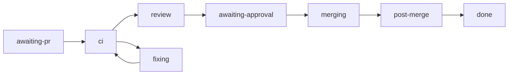

# Shepherd: from a registered PR to a merge

Shepherd is the `shepherd-pr` workflow inside the [factory](/guides/factory) and the
`titan-factory shepherd` verbs that drive it. You register a pull request, or a branch whose
pull request is not open yet. Shepherd then waits for CI, keeps the branch current, asks for
the merge decision its policy requires, merges the exact approved head, and reads main CI on
the merge commit.

Read [what is not built yet](#what-is-not-built-yet) before you rely on it. The review phase
runs only when `shepherd.review` is configured. Without it, every Shepherd merge waits for
the owner.

## Prerequisites

Everything in the [factory guide](/guides/factory#prerequisites): a built checkout, `gh`
logged in, and a base branch with at least one required check. Run `titan-factory serve` so
runs stay alive after your shell exits. Each verb below calls the server when one answers on
`--port` (default 7410) and opens the database directly when none does. Every verb takes
`--json` to print the result object instead of the one-line form.

## Register

```sh
titan-factory shepherd register owner/repo#123 --task initiative/42 --implementer impl-1
titan-factory shepherd register owner/repo --branch feat/example --task initiative/42 --implementer impl-1
```

```
run ab0f9228-… shepherd-pr owner/repo (feat/example): started; policy owner-gate
```

`--task` and `--implementer` are required. The target is `owner/repo#N`, or `owner/repo`
with `--branch`. The other flags:

| Flag | Meaning |
| --- | --- |
| `--reviewer <name>` | the agent that reviews |
| `--kind <kind>` | `correctness`, `security`, `feature`, `refactor` or `unknown` (the default) |
| `--policy <json>` | narrows the seat policy; see [seat policy](#seat-policy) |

Registration is idempotent (`products/factory/src/shepherd/commands.ts`). A repeat for the
same `repo#pr`, or for the pull request's head branch, updates the task, implementer,
reviewer, kind and policy on the existing registration and returns the same run:

```
run ab0f9228-… shepherd-pr owner/repo (feat/example): already registered, metadata updated; policy never
```

A branch registered first and its pull request registered later share one run. A
registration by number reads the pull request from GitHub to learn its head branch, so it
needs `gh`. A `--branch` that is not the pull request's head is refused.

With no server running, the run is recorded and the verb says so on stderr:
`no titan-factory serve answered on port 7410, so the run was recorded here; titan-factory
serve drives it`.

## Phases



A phase is a view over the run's current step (`products/factory/src/shepherd/view.ts`).

| Phase | The run is |
| --- | --- |
| `awaiting-pr` | polling every 30 seconds for a pull request on the registered branch, with no timeout |
| `ci` | reading branch rules, waiting for required checks, updating a branch that is behind, or rerunning a cancelled run |
| `fixing` | waiting for a new head after a human chose to await a fix |
| `review` | reading the review verdict and the registration's policy for a green head |
| `awaiting-approval` | recording the merge decision, or waiting on a gate: `approve-merge`, `ci-failed`, `sh-sent-back` or `stuck-behind` |
| `merging` | merging the approved head; a held pull request waits here |
| `post-merge` | reading main CI on the merge commit, for up to 60 minutes, then [freezing on red or thawing on green](#after-the-merge) |
| `done`, `failed`, `cancelled` | finished |

Shepherd runs no deploy, release or activation stage and does not run the factory's
`postMerge` chore.

## After the merge {#after-the-merge}

The `sh-main-ci` step reads main CI on the merge commit once, for up to 60 minutes. What
happens next depends on the verdict (`products/factory/src/shepherd/post-merge.ts` and
`main-red.ts`).

**Unread.** No run appeared at the merge sha. The run opens `main-red` and freezes nothing.

**Red.** The run freezes the repo, then works through three steps:

1. `sh-freeze` freezes the repo at the merge sha. A freeze is one row per repo; a red in a
   live freeze counts up, and a red after a thaw starts a new episode.
2. `sh-file-fix-task` files one high-severity active-work task per episode, over
   active-work's loopback rpc (`127.0.0.1:$AW_PORT`, default 7400). The task goes into the
   initiative of the merged pull request's `--task` when that reads `<initiative>/<id>`, and
   into `titan-platform` otherwise. It carries the failing jobs and their fenced log tails,
   and is tagged with a key built from the repo and the merge sha, so a replay after a crash
   finds it instead of filing a second one. A daemon that is down is retried for up to 60
   minutes.
3. `sh-spawn-fixer` spawns one fixer per episode, if the run's policy grants `fixer`. The
   grant holds when a seat lists the repo and `--policy` does not set `"fixer":false`. The
   fixer is an agent-chat agent on the `implementer` profile, named
   `fix-<repo>-<short merge sha>`, started in the repo's seat checkout. Its brief tells it to
   register its fix pull request with the fix task and with itself as `--implementer`. It
   needs `shepherd.agentChatBin` in the [config file](/guides/factory#the-config-file).

While the repo is frozen, every merge route waits in `merging`, the same way a hold does.
One pull request is exempt: the one whose registration names the episode's fix task and
the episode's fixer as its implementer. The guard also re-reads the default branch at most
every five minutes, and a green head there thaws the repo.

**Green.** `sh-unfreeze` thaws a frozen repo when the merge commit descends from the red sha
and every check that was red there ran green again. A path filter that skips a red check
therefore cannot thaw it.

Every outcome that leaves the repo frozen with nothing in place to clear it opens a gate
with the owner's release on offer:

- `main-red-again`: main went red while the episode already had a fixer, the fixer's own
  merge included. No second fixer is spawned.
- `main-frozen`: no fix task was filed, no fixer was spawned (notify-only policy, no
  agent-chat, no checkout, or a failed spawn), or a green merge left the repo frozen.

The answer is `{"decision":"stay-frozen"|"unfreeze","mergeSha":"<merge sha>"}`. `unfreeze`
thaws only the episode the gate opened for. If the repo has thawed and frozen again since,
the answer changes nothing. Each run opens its own gate, so one episode can leave several
open; answer any one with `unfreeze` and the rest go stale.

## Watch

```sh
titan-factory shepherd status                  # every registration
titan-factory shepherd status owner/repo       # one repo
titan-factory shepherd status owner/repo#123   # one pull request
titan-factory shepherd list --state all        # active (default), finished or all
titan-factory shepherd timeline owner/repo#123
```

```
owner/repo#123 ci 1a2b3c4 waiting for CI on 1a2b3c4
owner/repo feat/example awaiting-pr - waiting for a PR on the registered branch
```

Each line is the target, the phase, the short head, the next action, and any blockers in
brackets: `held: <reason>` or `stalled: <reason>`. Only a failed or parked run reads as
stalled; there are no per-phase time limits yet. With nothing registered the verbs print
`no shepherded PRs`. `timeline` prints the same row and then every step, CI read and gate
the run recorded, oldest first. `--json` returns the `WatchRow` and `PrTimeline` shapes the
factory UI reads.

## Seat policy {#seat-policy}

Every registration resolves a policy before anything starts
(`products/factory/src/shepherd/policy.ts`). The merge mode is one of three:

| Mode | Effect |
| --- | --- |
| `never` | the merge decision is `deny` and the run stops |
| `owner-gate` | every merge waits on the `approve-merge` gate |
| `auto` | a merge may go through without the owner when the authority row holds; otherwise it gates |

The ceiling comes from seat files. A repo that no seat lists gets `owner-gate`. A seat whose
`grants_extra` includes `merge-on-green-approve` raises the ceiling to `auto`. `--policy`
can only narrow the ceiling, never widen it: `{"merge":"auto"}` on an unlisted repo still
resolves to `owner-gate`. The other `--policy` keys are `mergeMethod` (`merge`, `squash` or
`rebase`; default `squash`), `reviewer`, `priority` and `fixer`. An unknown key is refused.

Seat files are read from `shepherd.seatsDir` in the
[config file](/guides/factory#the-config-file): every `*.md` file there, frontmatter only
(`products/factory/src/shepherd/seats.ts`).

```markdown
---
schema: autonomy-seat/v1
name: platform
repos:
  - path: ~/projects/example-repo
    remote: owner/example-repo
deny_repos:
  - ~/projects/dotfiles
grants_extra:
  - merge-on-green-approve
---
```

- **`repos`** lists the remotes the seat owns. A remote that several seats list gets only
  the grants they all share.
- **`deny_repos`** lists checkout paths no registration may target. A deny path that a seat
  binds to a remote denies that remote. A path no seat binds denies its last segment as a
  repo name under any owner.
- **Charter hard stops.** `shepherd.charterPath` names an `autonomy-charter/v1` file with a
  `hard_stops` list. `shepherd.hardStopRepos` maps a hard-stop id to the remotes it forbids.
- A deny wins over any seat. The refusal is
  `registration refused: owner/repo is on a seat deny list or a charter hard stop`, and no
  run starts.

The seat book is read again on every `register`, so a change applies without a restart. An
invalid seat file or charter fails every registration until it is fixed. Path spelling
rules are in the
[product README](https://github.com/HJewkes/titan-platform/blob/main/products/factory/README.md#shepherd-seat-paths).

The run re-reads its registration's policy before every merge decision and keeps the
stricter of the two. A later `register` can tighten a running pull request's policy. It
cannot loosen it.

## Hold and release

```sh
titan-factory shepherd hold owner/repo#123 --reason "waiting on a schema decision"
titan-factory shepherd release owner/repo#123
```

```
run ab0f9228-…: held (waiting on a schema decision)
run ab0f9228-…: released
```

A hold does not stop the run. CI waits, branch updates and gates carry on. The hold blocks
the merge call itself: every merge route reads the hold first, and a held pull request waits
in `merging`, polling every 10 seconds, until `release`
(`products/factory/src/shepherd/hold.ts`). The check covers `land-pr` too, so
`titan-factory land` on a held pull request also waits. Both verbs take `owner/repo#N`, so a
branch registration can be held only once its pull request exists.

## `merge` evaluates, and resolves nothing

```sh
titan-factory shepherd merge owner/repo#123
```

```
run ab0f9228-… awaiting-approval: policy says gate (seat none policy owner-gate waits for the owner on merge); owner: resolve approve-merge
```

`merge` reports three things: what the policy decides for the current head, whether the
pull request is held, and what the run waits on. It never signals the run and never
resolves a gate. An agent can call it over MCP to learn why a pull request has not merged.
It cannot use it to merge.

## Resolving a gate is CLI-only

`gate resolve` is not a registry command. No `/rpc` route and no MCP tool can answer a gate
(`products/factory/src/shepherd/surface.test.ts` asserts that no tool name contains
`resolve`). The owner answers at a terminal:

```sh
titan-factory gate resolve <runId> approve-merge --json '{"decision":"merge","headSha":"<40 hex>"}'
```

| Gate | Opens when | Payload |
| --- | --- | --- |
| `approve-merge` | a green head needs the owner | `{"decision":"merge"\|"abandon","headSha":"…"}` |
| `ci-failed` | a head is red and no agent took the wake | `{"decision":"rerun"\|"abandon"\|"await-fix","headSha":"…"}` |
| `stuck-behind` | the branch is still behind after three updates | `{"decision":"retry"\|"abandon"}` |
| `sh-sent-back` | a review sent the head back and no agent took the wake | `{"decision":"await-new-head"\|"abandon"}` |
| `main-red` | main CI on the merge commit is unread, or red with no freeze store wired | `{"decision":"acknowledged","mergeSha":"…"}` |
| `main-red-again` | main is red again while the episode already has a fixer | `{"decision":"stay-frozen"\|"unfreeze","mergeSha":"…"}` |
| `main-frozen` | the repo is frozen with no fix task, no fixer, or after a green merge that did not thaw it | `{"decision":"stay-frozen"\|"unfreeze","mergeSha":"…"}` |

`titan-factory resume` and the `factory.gates` command print the exact resolve command for
each open gate.

## The MRG-AU-RV row and the merge evidence

Under `auto`, one rule lets Shepherd merge without the owner: `MRG-AU-RV` in the
[`authority`](/reference/authority) table. It allows a merge by automation when all of these
hold at the exact head being merged (`packages/authority/src/table.json`):

- the verdict's author is the reviewer this run dispatched, and the verdict is `MERGE` at
  this head;
- every required check context is green, from GitHub Actions, and no other run on the head
  is non-green;
- GitHub's test merge of this head is clean;
- the repo is not frozen;
- no protected path changed;
- the seat grants `merge-on-green-approve`.

Shepherd adds its own guards before it asks authority
(`products/factory/src/shepherd/merge-facts.ts`). No collected facts, facts collected at
another head, or any changed path under `.github/` sends the merge to the owner. A file list
that GitHub truncated counts as no list. Every fact is read from GitHub or from the run's
own step outputs, never from the reviewer's text. Any other authority rule that allows still
gates: only `MRG-AU-RV` merges without the owner.

The `sh-merge-evidence` step collects those facts once per head and posts one comment on the
pull request. The comment starts with the marker `<!-- shepherd-evidence:<head sha> -->`, so
a replay finds it instead of posting again. It carries a one-line summary and a JSON record:
the run id, repo, pull request, head, base, GitHub's test-merge sha, each check run with its
app id and conclusion, a reference to the reviewer's verdict (session id, record offsets and a hash of the full locator, with no path, host or source id), the reviewer's identity, and
the decision with its rule and reason. On an allow, the same record is stored with the
`merge-policy` step, with the full locator in place of the reference.

To recompute `locatorSha256`, take the stored locator, run `JSON.stringify` on it with its keys
in their original insertion order, and take the SHA-256 hex digest. Only the reader that
produced the locator keeps that key order, so a re-serialized copy may not match.

## What is not built yet

The land core, the hold, the policy resolution, the gates, the post-merge main CI read and
the freeze all run today, and so does the review phase when it is configured. These parts are not built:

- **The review phase is opt-in.** With `shepherd.review` set (see the
  [config file](/guides/factory#the-config-file)), `reviewPhase` in
  `products/factory/src/shepherd/review.ts` dispatches a reviewer through agent-chat in the
  checkout the seat book binds to the repo, and reads its verdict from that agent's
  transcript. A verdict then reaches the `MRG-AU-RV` decision, and the `sh-merge-evidence`
  step posts the evidence comment. With no `review` key, no checkout for the repo, or a
  refused dispatch, the phase records `none` with the reason, the run opens `approve-merge`,
  and the owner decides.
- **The wake phase.** `wakePhase` in `products/factory/src/shepherd/wake.ts` answers
  `unhandled` to every request. No agent is woken for a red head, a conflict or a review
  send-back. A red head opens `ci-failed`. A conflicting head ends the run as `done`, with
  a `not-mergeable` outcome.
- **The registration's agents.** Only the freeze exemption reads `--implementer`.
  `--reviewer` and `--kind` are stored on the registration, and no shipped phase reads
  them. `register` accepts any `--implementer` string, so the exemption stops honest
  mistakes, not a determined caller.
- **Stall limits.** A run that waits a long time in one phase is not flagged.

## How it fails

| What you see | Why |
| --- | --- |
| `error: registration refused: …` | the repo is on a seat deny list or a charter hard stop |
| `error: invalid seat file <path>: …` or `error: invalid charter <path>: …` | a seat file or the charter does not parse; no registration succeeds until it does |
| `error: Invalid arguments: pr: needs a pr or a branch` | `owner/repo` without `--branch` |
| `error: Invalid arguments: policy: Unrecognized key: "…"` | an unknown `--policy` key |
| `error: owner/repo#123 has head <a>, not <b>` | `--branch` is not the pull request's head |
| `error: owner/repo#123 is not registered with shepherd` | `hold`, `release`, `merge` or `timeline` on an unknown pull request |
| `error: expected owner/repo#N, got …`, exit 2 | a malformed reference |
| `error: gh api … failed …` | `gh` cannot reach GitHub; a verb that looks a pull request up needs it |
| a row with `[stalled: …]` | the run failed or is parked as `recovery_required`; `titan-factory resume` reports it |
